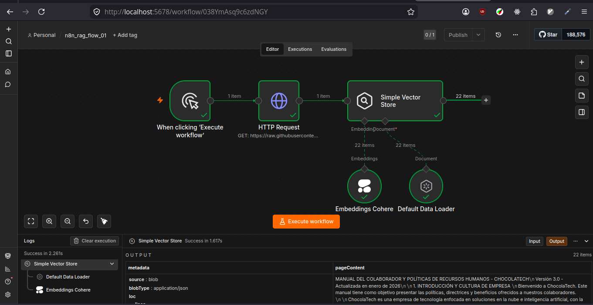
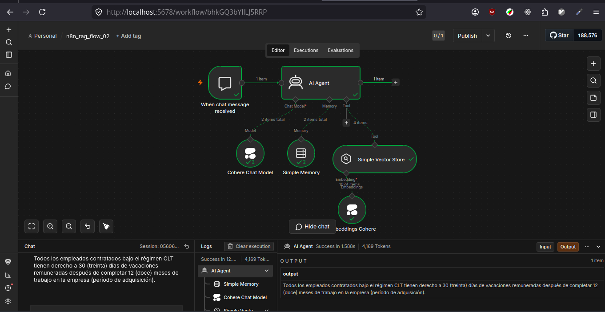

# Cerebro de Agente IA: RAG con n8n y Cohere

Este proyecto demuestra cómo transformar documentos estáticos (PDFs, TXT, Manuales) en un Agente de Inteligencia Artificial capaz de responder preguntas basadas en un contexto real. Utiliza una arquitectura RAG (Generación Aumentada por Recuperación) implementada sobre n8n.

Está especialmente diseñado para el sector educativo, permitiendo que docentes y administradores interactúen con normativas, guías y materiales pedagógicos de forma inteligente.

## ¿Qué aprenderás con este proyecto?

- Fundamentos de RAG: Cómo conectar una IA a datos externos para evitar alucinaciones.
- Embeddings con Cohere: Transformación de texto en vectores numéricos para búsqueda semántica.
- Flujos de Ingestión: Automatización de la carga y "troceado" (splitting) de documentos.
- Agentes Autónomos: Configuración de nodos de IA en n8n para toma de decisiones.

## Requisitos Previos

- Docker y Docker Compose instalados.
- n8n (versión con nodos de IA habilitados).
- API Key de Cohere (puedes obtener una gratuita en [Cohere](https:www.cohere.com)).

## Estructura del proyecto

```bash
.
├── chocolatech-inmersion-g10/   # Documentación base (Contexto del Agente)
│   ├── Manual de RH.txt
│   ├── Política de Viajes.txt
│   └── ...
├── output/                      # Carpeta para archivos procesados
├── docker-compose.yml           # Configuración del entorno n8n
├── .env                         # Credenciales
├── .env.example                 # Ejemplo de Credenciales
├── docker-compose.yml           # Configuración del entorno n8n
└── README.md
```

## Configuración del entorno

1. **Clonar el Repositorio**:

```bash
git clone https://github.com/felipe300/n8n_rag.git
cd n8n_rag
```

2. **Configura tus variables de entorno**

Copia el archivo y edita el archivo `.env`.

```bash
cp .env.example .env
```

3. **Inicia el Proyecto**

En la raíz del proyecto, ejecuta:

```bash
# levantar docker compose
docker compose up -d

# detener docker compose
docker compose down
```

4. **Revisa la URL**:

Abre tu navegador en `http://localhost:5678` e ingresa con las credenciales:

- Usuario: `admin`
- Password: `admin_rag`

También puedes crear un nuevo usuario al completar el formulario.

## Arquitectura del Agente

En entornos locales, la ejecución de los flujos pueden tomar más tiempo.

El flujo de trabajo se divide en dos fases críticas:

1. **Flujo de Ingestión (Load Data Flow)**

Se encarga de leer los archivos de la carpeta ./chocolatech-inmersion-g10, dividirlos en fragmentos manejables y generar los embeddings multilingües con Cohere para guardarlos en una base de datos vectorial (Vector Store).



2. **Flujo de Consulta (Query Flow)**

Cuando el usuario hace una pregunta, el agente busca en el Vector Store los fragmentos más relevantes y utiliza un LLM para redactar una respuesta precisa basada únicamente en esos fragmentos.



## Enlaces de Interés

- [n8n.io](https://n8n.io/) - Plataforma de automatización.
- [Cohere Dashboard](https://cohere.com/) - Gestión de API Keys y Modelos.
- [Manual del Colaborador y Políticas de Recursos Humanos - CHOCOLATECH](https://raw.githubusercontent.com/ericmonne/chocolatech-inmersion-g10/refs/heads/main/Manual%20de%20RH%20ChocolaTech%20LAD.txt)
- [Repositorio de Archivos CHOCOLATECH](https://github.com/ericmonne/chocolatech-inmersion-g10) - Documentación de ejemplo para inmersión.
