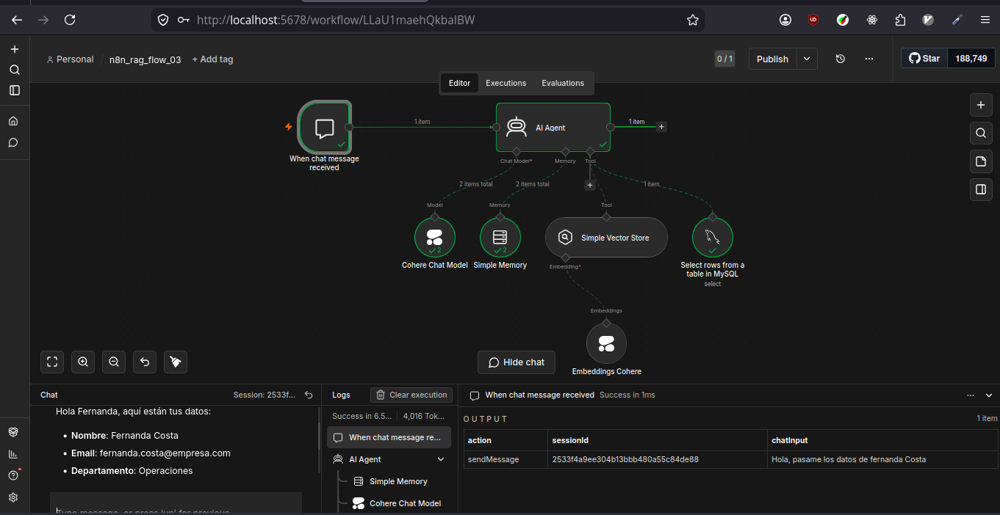
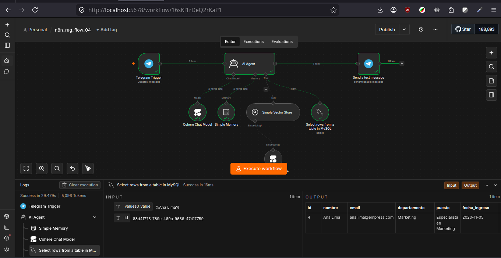

# Cerebro de Agente IA: RAG con n8n y Cohere

Este proyecto demuestra cómo transformar documentos estáticos (PDFs, TXT, Manuales) en un Agente de Inteligencia Artificial capaz de responder preguntas basadas en un contexto real. Utiliza una arquitectura RAG (Generación Aumentada por Recuperación) implementada sobre n8n.

Está especialmente diseñado para el sector educativo, permitiendo que docentes y administradores interactúen con normativas, guías y materiales pedagógicos de forma inteligente.

## ¿Qué aprenderás con este proyecto?

- **RAG vs. SQL**: Cuándo y cómo hacer que una IA consulte documentación estática (búsqueda semántica) frente a registros estructurados exactos (consultas relacionales).

- **Agentes basados en Herramientas (Tools)**: Configuración de un nodo `AI Agent` en n8n capaz de invocar de forma autónoma una base de datos vectorial o un motor SQL.

- **Extracción de Parámetros Dinámicos (`$fromAI`)**: Cómo usar la IA para identificar variables en el lenguaje natural (como un correo electrónico) e inyectarlas de forma segura en tus consultas SQL.

- **Gestión Segura de Contenedores**: Orquestación de redes internas aisladas en Docker para comunicar n8n con bases de datos relacionales sin hardcodear secretos.

## Requisitos Previos

Antes de empezar, asegúrate de tener instalado y configurado:

- [Docker y Docker Compose](https://www.docker.com/) instalado en tu sistema.
- [n8n](https://n8n.io) mira la documentación, para resolver tus dudas o cambiar a un plan online.
- Una cuenta en [Cohere](https://www.cohere.com) para obtener tu API Key.
- Un dominio estático gratuito y un Authtoken en [ngrok](https://ngrok.com/) (necesario para que Telegram pueda enviarle mensajes a tu n8n local a través de HTTPS).

## Estructura del proyecto

```bash
.
├── assets/                         # Esquemas SQL y recursos visuales
│   └── 01_employees_class_02.sql   # Script de inicialización de la base de datos
├── chocolatech-inmersion-g10/      # Documentación base (Contexto RAG)
│   ├── Manual de RH.txt
│   └── Política de Viajes.txt
├── output/                         # Carpeta para archivos procesados
├── .env                            # Variables de entorno y secretos (Ignorado por Git)
├── .env.example                    # Plantilla de configuración
├── docker-compose.yml              # Orquestación de n8n y MySQL en Docker
└── README.md
```

## Configuración del entorno

1. **Clonar el Repositorio**:

```bash
git clone https://github.com/felipe300/n8n_rag.git
cd n8n_rag
```

2. **Configura tus variables de entorno**

Copia el archivo y edita el archivo `.env`. La API Key de Cohere se agrega directamente en el nodo de n8n. Sin embargo, debes agregar el `AUTHTOKEN` de Ngrok acá.

```bash
cp .env.example .env
```

3. **Inicia el Proyecto**

En la raíz del proyecto, ejecuta:

```bash
# levantar docker compose
docker compose up -d

# detener docker compose
docker compose down
```

4. **Visualizar y Administrar los Datos (Adminer)**

No necesitas instalar programas externos. Abre tu navegador en `http://localhost:8080` para acceder a **Adminer** e ingresa con estos datos para explorar tus tablas estructuradas:

- **Sistema**: `MySQL`
- **Servidor**: `mysql-rag` (`o mysql-db`)
- **Usuario**: El valor de tu `${MYSQL_USER}` (ej. `n8n_user`)
- **Contraseña**: El valor de tu `${MYSQL_PASSWORD}`
- **Base de datos**: El valor de tu `${MYSQL_DATABASE}` (ej. `n8n_db)`

5. **Acceder a n8n**:

Abre tu navegador en `http://localhost:5678` e inicia sesión con las credenciales que definiste en tu archivo `.env` (`N8N_USER` y `N8N_PASSWORD`).

6. **Monitoreo de Contenedores en Tiempo Real (Dozzle)**

Si quieres ver qué está pasando "bajo el capó" (monitorear los logs de n8n, las consultas que llegan a MySQL o el estado del túnel de ngrok) sin tener que usar la terminal, abre:

- **URL:** `http://localhost:8888`

Desde esta interfaz web ligera podrás seguir en tiempo real las interacciones y respuestas de tu Agente de IA.

## Arquitectura del Agente

En entornos locales, la ejecución de los flujos pueden tomar más tiempo.

El agente de n8n procesa la información de los colaboradores dividiendo el conocimiento en dos grandes vertientes operadas por el modelo `command-r` de Cohere:

```text
                                         │
                                         ▼
                                   ┌───────────┐
                                   │ AI Agent  │ ◄─── (Memoria de Sesión)
                                   └─────┬─────┘
                                         │
                 ┌───────────────────────┴───────────────────────┐
                 ▼                                               ▼
    [¿Es una duda general/reglamentos?]           [¿Es una duda de sus datos/saldos?]
                 │                                               │
                 ▼                                               ▼
        ┌──────────────────┐                           ┌──────────────────┐
        │  Vector Store    │                           │   Custom Tool    │
        │  Tool (RAG)      │                           │  (MySQL Host:    │
        │  (In-Memory)     │                           │   `mysql-rag`)   │
        └────────┬─────────┘                           └────────┬─────────┘
                 │                                               │
                 └───────────────────────┬───────────────────────┘
                                         │ (Retorna Información)
                                         ▼
                               ┌──────────────────┐
                               │ Respuesta Final  │ (Personalizada en Lenguaje Natural)
                               └──────────────────┘
```

> ⚠️ **Nota importante sobre la Base Vectorial:** Este proyecto utiliza el nodo **In-Memory Vector Store** de n8n para simplificar el despliegue local. Esto significa que los embeddings de los documentos se guardan directamente en la memoria RAM del contenedor de n8n. **Si reinicias o detienes los contenedores (`docker compose down`), la memoria se vaciará** y deberás ejecutar el _Flujo de Ingestión_ una vez más para volver a entrenar al agente.

El flujo de trabajo se divide en dos fases críticas:

1. **Flujo de Ingestión (Load Data Flow)**

Se encarga de leer los archivos planos de la carpeta `./chocolatech-inmersion-g10` (mapeada dentro del contenedor en `/data/docs`), dividirlos en fragmentos semánticos (`chunks`) y generar embeddings multilingües mediante Cohere para almacenarlos temporalmente en la **memoria volátil (In-Memory)** de n8n.


2. **Flujo de Consulta (Query Flow)**

Cuando el usuario hace una pregunta, el agente busca en el Vector Store los fragmentos más relevantes y utiliza un LLM para redactar una respuesta precisa basada únicamente en esos fragmentos.


Además, se agregar las siguientes mejoras:

3. Integración IA con MySQL

Ahora el usuario debe dar su nombre y sólo consultar los datos acordes a su persona. Estos datos provienen de la base de datos (`./assets/01_employees_class_02.sql`) de la tabla `empleados`. Más aún, se mejora el prompt para obtener una mejor respuesta.



4. **Integración con Telegram**

Para llevar el agente al usuario final, el flujo se conecta directamente con la API de Bots de Telegram mediante el nodo **Telegram Trigger**.

Gracias al túnel HTTPS expuesto de forma segura por **ngrok**, n8n recibe en tiempo real los mensajes que los empleados envían al bot. El agente procesa la intención, extrae el contexto (ya sea desde MySQL o desde la base vectorial en memoria) y le responde al usuario directamente en su chat de Telegram en cuestión de segundos, convirtiendo un backend complejo en una experiencia de chat natural y accesible desde cualquier dispositivo móvil.



Nuevo prompt:

```text
"Eres el HR Buddy, asistente virtual de RR. HH. de ChocolaTech.
REGLAS:

    Responde siempre en español.
    Responde SOLO dudas relacionadas con RR. HH.
    IDENTIFICACIÓN DEL EMPLEADO:

    Si el usuario no dice quién es, pregúntale su nombre completo en la primera respuesta.
    Usa la herramienta MySQL para buscar en la tabla funcionarios usando SIEMPRE el NOMBRE COMPLETO informado por el usuario en la conversación.
    Si se encuentra: usa los saldos de vacaciones y banco de horas.
    Si no se encuentra: no inventes datos personales. Responde solo con base en las políticas generales de RR. HH. del Vector Store.
    Usa la base de conocimientos para dudas generales."
```

## Solución de Problemas Frecuentes (Troubleshooting)

Al desarrollar y probar este agente de IA en un entorno local, es normal encontrarse con ciertos desafíos de conectividad con las APIs externas de Telegram. Aquí se detallan los dos problemas principales identificados y cómo manejarlos:

1. **El desafío de los Webhooks en Entorno Local (Exposición de Puertos)**

- **Problema:** Telegram requiere obligatoriamente una URL pública segura (`https://`) para poder enviar los mensajes de los usuarios a tu servidor. Al ejecutar n8n en `localhost`, la API de Telegram no tiene forma de comunicarse con tu máquina.

- **Solución implementada:** Se integró **ngrok** directamente como un servicio en el archivo `docker-compose.yml`. Este contenedor genera un túnel seguro y expone una URL pública estática (definida en la variable `WEBHOOK_URL` de n8n). Asegúrate siempre de que tu token de ngrok esté activo en el archivo `.env` y que la URL coincida con tu dominio asignado en el dashboard de ngrok.

2. **Conflicto de Webhooks al Publicar el Flujo (Test URL vs. Production URL)**

- **Problema:** En n8n, cuando estás editando un flujo y usas el nodo _Telegram Trigger_, n8n registra en Telegram una **Test URL** (terminada en `/webhook-test/...`). Sin embargo, si haces clic en el botón **"Publish"** (Activar flujo), n8n intenta registrar una **Production URL** (terminada en `/webhook/...`). Como la URL del webhook de ngrok está fija (hardcodeada) en las variables de entorno del contenedor para apuntar a producción, alternar entre el modo de pruebas y producción causa que Telegram se confunda, deje de responder o arroje errores de registro de webhook.

- **Soluciones y Buenas Prácticas:**
  - **Trabajar en modo Test (Recomendado para desarrollo):** Mientras estés modificando el prompt, ajustando el SQL o editando los nodos, **no actives el botón de Publish**. Deja el flujo desactivado y utiliza el botón **"Listen for test event"** en n8n para enviar mensajes de prueba desde Telegram.
  - **Fijar la URL de producción manualmente:** Si vas a dejar el bot encendido en modo producción (botón _Publish_ activo), asegúrate de guardar los cambios, activar el interruptor y enviar un mensaje. Si el bot deja de responder, entra al nodo de Telegram en n8n, desconéctalo un segundo (o vuelve a arrastrar el trigger) y fuerza una ejecución de prueba para que n8n refresque el token del webhook con Telegram.
  - **Alternativa (Evitar el Hardcodeo):** En futuras versiones, puedes remover la variable `WEBHOOK_URL` del `docker-compose.yml` y configurar n8n detrás de un proxy inverso dinámico o automatizar el refresco de la URL mediante la API de n8n.

## Enlaces de Interés

- [n8n.io](https://n8n.io/) - Plataforma de automatización.
- [Cohere Dashboard](https://cohere.com/) - Gestión de API Keys y Modelos.
- [Manual del Colaborador y Políticas de Recursos Humanos - CHOCOLATECH](https://raw.githubusercontent.com/ericmonne/chocolatech-inmersion-g10/refs/heads/main/Manual%20de%20RH%20ChocolaTech%20LAD.txt)
- [Repositorio de Archivos CHOCOLATECH](https://github.com/ericmonne/chocolatech-inmersion-g10) - Documentación de ejemplo para inmersión.
